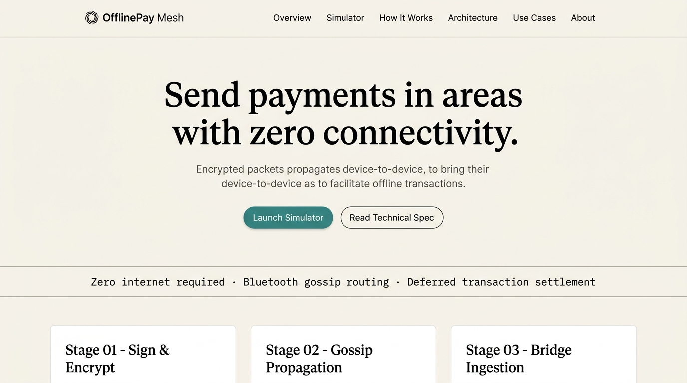
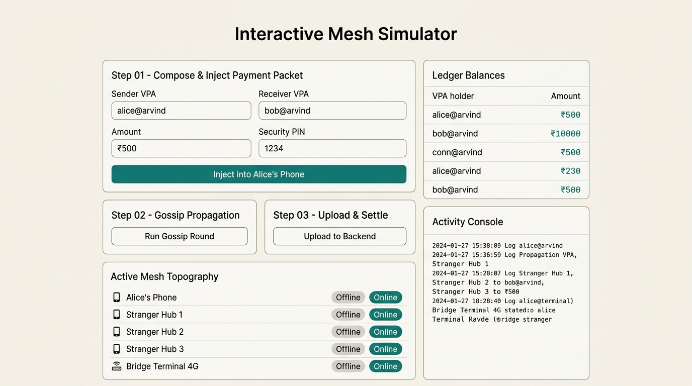

# OfflinePay Mesh (UPI Without Internet)

**Author:** Arvind Dwivedi

Welcome to the **OfflinePay Mesh** monorepo! This project demonstrates a conceptual architecture for routing UPI (Unified Payments Interface) transactions in environments with **zero internet connectivity** (e.g., deep basements, rural areas, disaster zones). 

Instead of requiring a direct connection to the bank, payment instructions are cryptographically signed, encrypted, and broadcasted via Bluetooth to nearby devices (gossip protocol) until a "bridge" device with an active internet connection automatically uploads the packet for secure settlement.

---

## 📸 Project Screenshots (Light Theme)

### 1. Landing Page


### 2. Interactive Mesh Simulator


### 3. System Architecture & Tech Stack


---

## 📂 Repository Folder Structure

```text
UPI-without-internet/
├── offlinepay-mesh/           # Java Spring Boot Backend API
│   ├── src/main/java/         # Application source code
│   │   ├── api/               # REST Endpoints (/gossip, /inject, /settle)
│   │   ├── security/          # Cryptography (RSA-2048-OAEP, AES-GCM)
│   │   ├── engine/            # Mesh Simulation & Idempotency Services
│   │   └── domain/            # H2 Database Entities (Account, Transaction)
│   ├── pom.xml                # Maven configuration
│   └── README.md              # Detailed backend documentation
│
├── offlinepay-web/            # Next.js Frontend Simulator & UI
│   ├── app/                   # App Router Pages
│   │   ├── demo/              # Interactive Simulator UI
│   │   ├── architecture/      # Technical Spec Page
│   │   ├── use-cases/         # Real-world Applications Page
│   │   └── about/             # Developer Info Page
│   ├── components/            # UI Components (Navbar, Cards, Badges)
│   ├── public/                # Static assets
│   └── README.md              # Detailed frontend documentation
│
├── docs/                      # Root Documentation Assets
│   └── screenshots/           # UI Mockups
│
└── README.md                  # This file
```

---

## 🚀 Quick Start (Run Locally)

You can run both the frontend and backend locally to test the simulator.

### Step 1: Start the Backend
Open a terminal in the `offlinepay-mesh` directory and run:
```bash
# Windows
.\mvnw.cmd spring-boot:run

# Mac/Linux
./mvnw spring-boot:run
```
*(Runs on `http://localhost:8080`)*

### Step 2: Start the Frontend
Open a second terminal in the `offlinepay-web` directory and run:
```bash
npm install
npm run dev
```
*(Runs on `http://localhost:3000`)*

### Step 3: Launch
Open your browser and navigate to **[http://localhost:3000](http://localhost:3000)**. 
Click on **Simulator** in the navbar to test the zero-internet payment routing!

---

## 📜 License
Built for learning, architectural demonstration, and portfolio purposes. Use freely.
