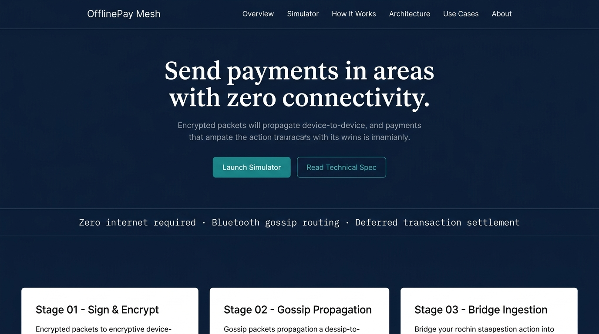
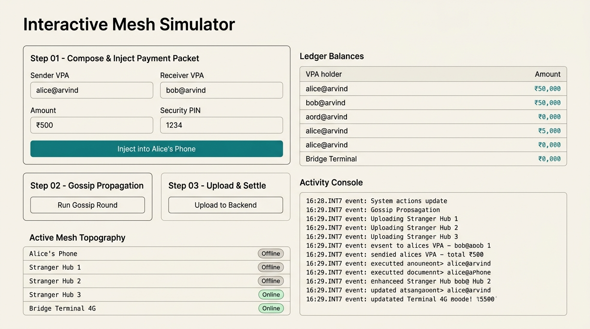
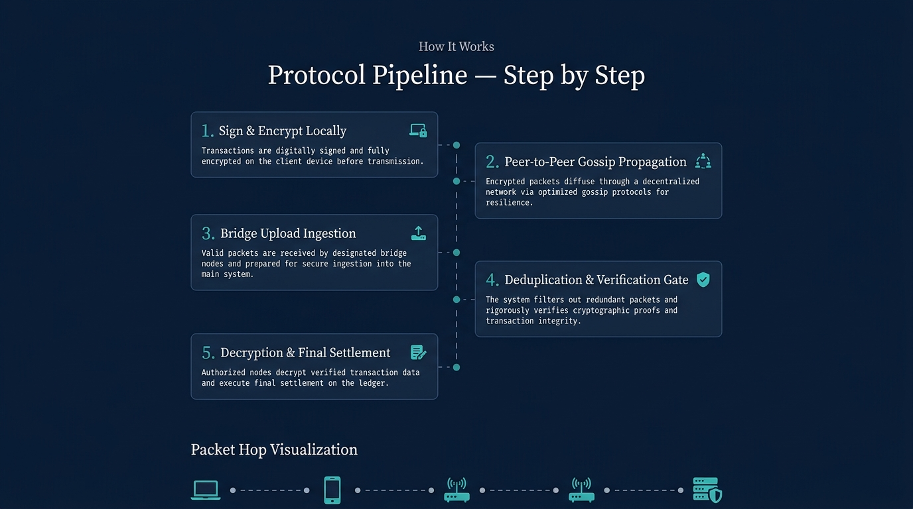
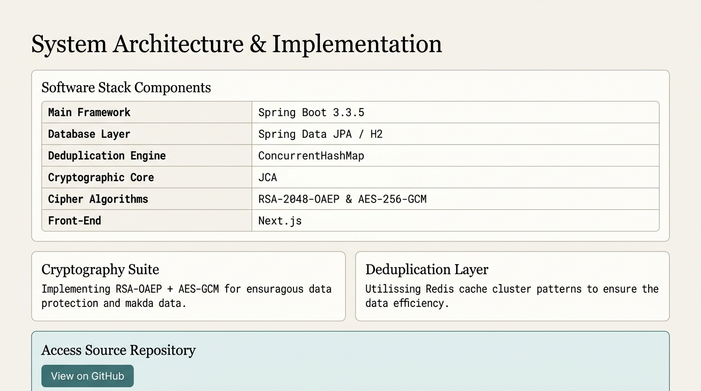

# OfflinePay Mesh

**Author: Arvind Dwivedi**

A Spring Boot backend demonstrating **offline UPI payments routed through a Bluetooth mesh network**. Picture this: you're in a basement with zero connectivity. You send your friend ₹500. Your phone encrypts the payment, broadcasts it to nearby phones via Bluetooth, and the packet hops device-to-device until *some* phone walks outside, gets 4G, and silently uploads it to this backend. The backend decrypts, deduplicates, and settles.

This project is the **server side** of that system, plus a software simulator of the mesh so you can demo the entire flow on a single laptop — no Bluetooth hardware needed.

---

## Screenshots

### Landing Page


### Interactive Mesh Simulator


### Protocol Pipeline


### System Architecture


---


## Key Features

1. **Tamper-proof payment routing** through untrusted intermediary devices using hybrid RSA-OAEP + AES-256-GCM encryption
2. **Atomic deduplication** — even if the same payment reaches the backend through multiple bridge nodes simultaneously, it settles exactly once
3. **Replay attack prevention** via freshness validation on encrypted timestamps
4. **Interactive dashboard** to visualize the full pipeline in real-time

---

## Quick Start

### Prerequisites

- **JDK 17+** installed and on PATH. Verify with `java -version`.
- That's it. No database, no Redis, no Maven installation needed — the Maven wrapper handles everything.

### Run on Windows

```cmd
.\mvnw.cmd spring-boot:run
```

### Run on Mac/Linux

```bash
./mvnw spring-boot:run
```

First run downloads dependencies (~80 MB). Subsequent starts take ~5 seconds.

### Open the Dashboard

Once you see `Started OfflinePayApplication in X.XXX seconds`, visit:

**http://localhost:8080**

### Run Tests

```cmd
.\mvnw.cmd test
```

---

## How It Works

### Architecture

```
┌──────────────────────────────────────────────────────────────────────┐
│                     SENDER PHONE (offline)                          │
│  PaymentInstruction { sender, receiver, amount, pinHash, nonce }    │
│              │                                                      │
│              ▼ encrypt with server's RSA public key                 │
│   MeshPacket { packetId, ttl, createdAt, ciphertext }               │
└────────────────────────────────┬─────────────────────────────────────┘
                                 │ Bluetooth gossip
                                 ▼
     ┌──────────┐  hop  ┌──────────┐  hop  ┌──────────┐
     │stranger-1│ ────► │stranger-2│ ────► │  bridge  │ ◀── walks outside
     └──────────┘       └──────────┘       └────┬─────┘     gets 4G
                                                │
                                                ▼ HTTPS POST
┌──────────────────────────────────────────────────────────────────────┐
│                   SPRING BOOT BACKEND (this project)                │
│                                                                     │
│  IngestionPipeline:                                                 │
│    [1] Hash ciphertext (SHA-256) → idempotency key                  │
│    [2] DeduplicationService.claim(hash) — atomic putIfAbsent        │
│    [3] EncryptionService.decrypt(ciphertext) — RSA + AES-GCM        │
│    [4] Freshness check: signedAt within 24 hours                    │
│    [5] SettlementEngine.execute() — @Transactional debit/credit     │
└──────────────────────────────────────────────────────────────────────┘
```

### The Three Hard Problems

#### 1. Untrusted Intermediaries
A random stranger's phone carries your transaction. They can't read it because the payload is encrypted with the server's public key using hybrid encryption (RSA-OAEP + AES-256-GCM). The GCM authentication tag ensures any tampering is detected on decryption.

#### 2. Duplicate Storm
Three bridge nodes hold the same packet and POST it simultaneously. `ConcurrentHashMap.putIfAbsent()` guarantees exactly one thread claims the hash — the rest are short-circuited as `DUPLICATE_DROPPED` before any decryption or settlement occurs.

#### 3. Replay Attacks
Two defenses:
- **Freshness window**: `signedAt` timestamp inside the encrypted payload must be within 24 hours. Attackers can't change it without breaking the GCM tag.
- **Unique nonce**: Each payment includes a UUID nonce, so even identical payments produce different ciphertexts and different hashes.

---

## Project Structure

```
offlinepay-mesh/
├── pom.xml                                    Maven build, Spring Boot 3.3, Java 17
├── README.md                                  This file
└── src/main/
    ├── resources/
    │   ├── application.properties             H2 in-memory DB, port 8080
    │   └── templates/dashboard.html           Interactive demo UI
    └── java/com/arvind/offlinepay/
        ├── OfflinePayApplication.java         Spring Boot entry point
        │
        ├── domain/                            Domain entities & repositories
        │   ├── Account.java                   JPA entity with @Version locking
        │   ├── AccountRepository.java
        │   ├── MeshPacket.java                Wire format (outer + encrypted)
        │   ├── PaymentInstruction.java        Decrypted payment payload
        │   ├── Transaction.java               Settlement ledger entry
        │   └── TransactionRepository.java
        │
        ├── security/                          Cryptography layer
        │   ├── KeyManager.java                RSA-2048 keypair lifecycle
        │   ├── EncryptionService.java         Hybrid RSA-OAEP + AES-GCM
        │   └── HashingService.java            SHA-256 utilities
        │
        ├── engine/                            Core business logic
        │   ├── PacketFactory.java             Simulated sender phone
        │   ├── VirtualDevice.java             One phone in the mesh
        │   ├── MeshEngine.java                Gossip protocol simulator
        │   ├── DeduplicationService.java      ConcurrentHashMap ≈ Redis SETNX
        │   ├── SettlementEngine.java          @Transactional debit/credit
        │   └── IngestionPipeline.java         hash → dedup → decrypt → settle
        │
        ├── api/                               REST endpoints
        │   ├── PaymentController.java         All API routes
        │   └── DashboardController.java       Serves dashboard at /
        │
        ├── config/
        │   └── AppConfig.java                 @EnableScheduling
        │
        └── exception/
            └── PaymentException.java          Structured error handling

src/test/java/com/arvind/offlinepay/
└── IngestionPipelineTest.java                 Concurrency + tamper + round-trip tests
```

---

## API Reference

| Method | Path | Description |
|--------|------|-------------|
| GET | `/` | Dashboard UI |
| GET | `/api/server-key` | Server's RSA public key (base64) |
| GET | `/api/accounts` | All accounts and balances |
| GET | `/api/transactions` | Last 20 transactions |
| GET | `/api/mesh/state` | Current state of every virtual device |
| POST | `/api/demo/send` | Simulate sender phone → encrypt + inject |
| POST | `/api/mesh/gossip` | Run one gossip round |
| POST | `/api/mesh/flush` | Bridge devices upload to backend |
| POST | `/api/mesh/reset` | Clear mesh + dedup cache |
| POST | `/api/bridge/ingest` | **Production endpoint** for real bridges |
| GET | `/h2-console` | Browse the in-memory database |

H2 console: JDBC URL `jdbc:h2:mem:offlinepay`, username `sa`, no password.

---

## Tests

Three tests covering the critical properties:

1. **`samePacketDeliveredByThreeBridgesSettlesExactlyOnce`** — 3 threads, 1 packet, simultaneous delivery. Asserts exactly 1 SETTLED, 2 DUPLICATE_DROPPED, and balance changed exactly once.
2. **`tamperedCiphertextIsRejected`** — Flip a byte in ciphertext → INVALID (AES-GCM tag fails).
3. **`encryptDecryptRoundTrip`** — Encrypt → decrypt produces identical data.

---

## Tech Stack

- **Java 17** + **Spring Boot 3.3.5**
- **H2 Database** (in-memory, zero-setup)
- **Thymeleaf** for server-rendered dashboard
- **Next.js 16** frontend (institutional fintech design) — see [offlinepay-web](../offlinepay-web/)
- **JCA** (Java Cryptography Architecture) for RSA-OAEP + AES-GCM

---

## License

Built for learning and portfolio demonstration. Use freely.
